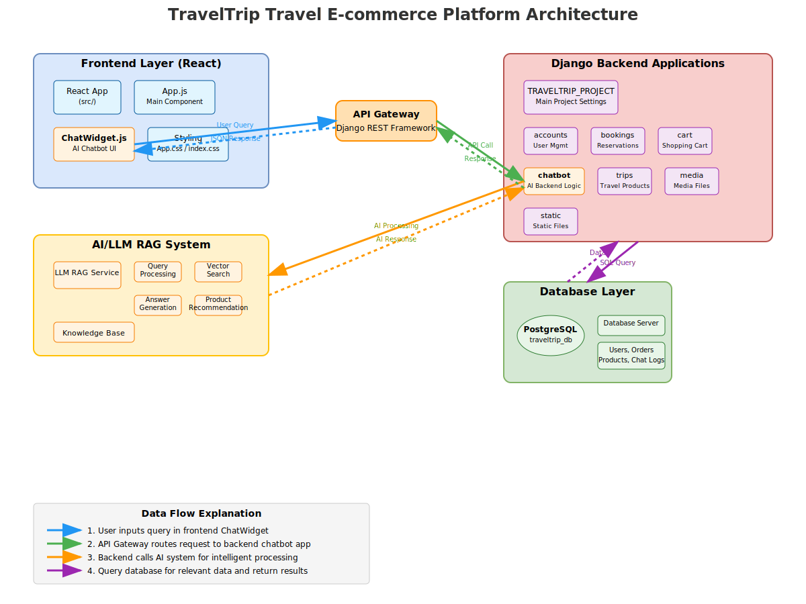

# TravelTrip - AI-Powered Travel E-commerce Platform 

An intelligent travel booking platform that combines modern web technologies with AI-powered recommendations to provide personalized travel experiences.


## Features

- **AI-Powered Chatbot**: Intelligent travel assistant with RAG (Retrieval-Augmented Generation) system
- **Dynamic Product Recommendations**: Personalized travel suggestions based on user preferences
- **Real-time Booking System**: Seamless reservation management for hotels, flights, and activities

## Architecture


### Tech Stack

**Frontend:**
- React.js 18+ with modern hooks
- CSS3 with responsive design
- Interactive ChatWidget for AI assistance

**Backend:**
- Django 4.2+ with Django REST Framework
- Python 3.9+
- Modular app architecture (accounts, bookings, cart, trips, chatbot)

**Database:**
- PostgreSQL 13+ for reliable data storage
- Optimized queries for travel data

**AI/ML:**
- LLM RAG System for intelligent responses
- Vector search for semantic understanding
- Product recommendation engine

**DevOps:**
- Docker & Docker Compose for containerization
- Environment-based configuration

## 📁 Project Structure

```
TRAVELTRIP_PROJECT/
├── frontend/                    # React frontend application
│   ├── src/
│   │   ├── App.js              # Main React component
│   │   ├── ChatWidget.js       # AI chatbot interface
│   │   └── ...
│   ├── package.json            # Node.js dependencies
│   └── public/
├── backend/                     # Django backend
│   ├── TRAVELTRIP_PROJECT/     # Main project settings
│   ├── accounts/               # User management
│   ├── bookings/               # Reservation system
│   ├── cart/                   # Shopping cart functionality
│   ├── chatbot/                # AI chatbot backend
│   ├── trips/                  # Travel products management
│   ├── media/                  # User uploaded files
│   ├── static/                 # Static assets
│   └── requirements.txt        # Python dependencies
├── ai_system/                  # AI/LLM RAG components
│   ├── llm_service.py          # LLM integration
│   ├── vector_search.py        # Semantic search
│   └── recommendation.py       # Product recommendations
├── docker-compose.yml          # Container orchestration
├── Dockerfile                  # Docker configuration
└── README.md                   # This file
```

## 🚀 Quick Start

### Prerequisites

- Docker and Docker Compose
- Python 3.9+ (for local development)
- Node.js 16+ (for frontend development)
- PostgreSQL 13+ (if running without Docker)

### Using Docker (Recommended)

1. **Clone the repository**
   ```bash
   git clone https://github.com/your-username/traveltrip.git
   cd traveltrip
   ```

2. **Environment Configuration**
   ```bash
   cp .env.example .env
   # Edit .env with your configuration
   ```

3. **Build and run with Docker Compose**
   ```bash
   docker-compose up --build
   ```

4. **Access the application**
   - Frontend: http://localhost:3000
   - Backend API: http://localhost:8000
   - Admin Panel: http://localhost:8000/admin

### Local Development Setup

#### Backend Setup

1. **Create virtual environment**
   ```bash
   python -m venv venv
   source venv/bin/activate  # On Windows: venv\Scripts\activate
   ```

2. **Install dependencies**
   ```bash
   cd backend
   pip install -r requirements.txt
   ```

3. **Database setup**
   ```bash
   python manage.py makemigrations
   python manage.py migrate
   python manage.py createsuperuser
   ```

4. **Run Django server**
   ```bash
   python manage.py runserver
   ```

#### Frontend Setup

1. **Install dependencies**
   ```bash
   cd frontend
   npm install
   ```

2. **Start development server**
   ```bash
   npm start
   ```

##  API Documentation

### Main Endpoints

- **Authentication**: `/api/auth/`
- **User Management**: `/api/accounts/`
- **Trip Products**: `/api/trips/`
- **Bookings**: `/api/bookings/`
- **Shopping Cart**: `/api/cart/`
- **AI Chatbot**: `/api/chatbot/`

### Example API Usage

```javascript
// Get travel recommendations
fetch('/api/chatbot/recommend/', {
  method: 'POST',
  headers: {
    'Content-Type': 'application/json',
    'Authorization': 'Bearer your-token'
  },
  body: JSON.stringify({
    message: "I want to visit Japan in spring",
    preferences: ["culture", "nature", "food"]
  })
})
```

##  Deployment

### Production Deployment

1. **Update environment variables for production**
2. **Build production Docker image**
   ```bash
   docker-compose -f docker-compose.prod.yml up --build -d
   ``


# TravelTrip - AI 智能旅遊電商平台

結合現代網頁技術與 AI 推薦系統的智能旅遊訂房平台，提供個人化的旅遊體驗。

## 功能特色

- **AI 智能聊天機器人**：具備 RAG（檢索增強生成）系統的智能旅遊助手
- **動態產品推薦**：基於用戶偏好的個人化旅遊建議
- **即時預訂系統**：無縫的酒店、機票和活動預訂管理

## 系統架構


### 技術棧

**前端：**
- React.js 18+ 使用現代 hooks
- CSS3 響應式設計
- 互動式聊天組件提供 AI 助手功能

**後端：**
- Django 4.2+ 搭配 Django REST Framework
- Python 3.9+
- 模組化應用架構（帳戶、預訂、購物車、旅遊、聊天機器人）

**資料庫：**
- PostgreSQL 13+ 確保資料存儲的可靠性
- 針對旅遊數據進行查詢優化

**AI/ML：**
- LLM RAG 系統提供智能回應
- 向量搜索實現語義理解
- 產品推薦引擎

**DevOps：**
- Docker & Docker Compose 容器化
- 環境配置管理

## 📁 專案結構

```
TRAVELTRIP_PROJECT/
├── frontend/                    # React 前端應用
│   ├── src/
│   │   ├── App.js              # 主要 React 組件
│   │   ├── ChatWidget.js       # AI 聊天機器人介面
│   │   └── ...
│   ├── package.json            # Node.js 依賴
│   └── public/
├── backend/                     # Django 後端
│   ├── TRAVELTRIP_PROJECT/     # 主要專案設定
│   ├── accounts/               # 用戶管理
│   ├── bookings/               # 預訂系統
│   ├── cart/                   # 購物車功能
│   ├── chatbot/                # AI 聊天機器人後端
│   ├── trips/                  # 旅遊產品管理
│   ├── media/                  # 用戶上傳檔案
│   ├── static/                 # 靜態資源
│   └── requirements.txt        # Python 依賴
├── ai_system/                  # AI/LLM RAG 組件
│   ├── llm_service.py          # LLM 整合
│   ├── vector_search.py        # 語義搜索
│   └── recommendation.py       # 產品推薦
├── docker-compose.yml          # 容器編排
├── Dockerfile                  # Docker 配置
└── README.md                   # 說明文件
```

## 🚀 快速開始

### 前置要求

- Docker 和 Docker Compose
- Python 3.9+（本地開發）
- Node.js 16+（前端開發）
- PostgreSQL 13+（非 Docker 環境）

### 使用 Docker（推薦）

1. **複製專案**
   ```bash
   git clone https://github.com/your-username/traveltrip.git
   cd traveltrip
   ```

2. **環境配置**
   ```bash
   cp .env.example .env
   # 編輯 .env 檔案設定您的配置
   ```

3. **使用 Docker Compose 建置和執行**
   ```bash
   docker-compose up --build
   ```


## 📋 API 文件

### 主要端點

- **身份驗證**：`/api/auth/`
- **用戶管理**：`/api/accounts/`
- **旅遊產品**：`/api/trips/`
- **預訂管理**：`/api/bookings/`
- **購物車**：`/api/cart/`
- **AI 聊天機器人**：`/api/chatbot/`

### API 使用範例

```javascript
// 取得旅遊推薦
fetch('/api/chatbot/recommend/', {
  method: 'POST',
  headers: {
    'Content-Type': 'application/json',
    'Authorization': 'Bearer your-token'
  },
  body: JSON.stringify({
    message: "我想在春天去日本旅遊",
    preferences: ["文化", "自然", "美食"]
  })
})
```

## 🚀 部署

### 生產環境部署

1. **更新生產環境變數**
2. **建置生產用 Docker 映像**
   ```bash
   docker-compose -f docker-compose.prod.yml up --build -d
   ```


